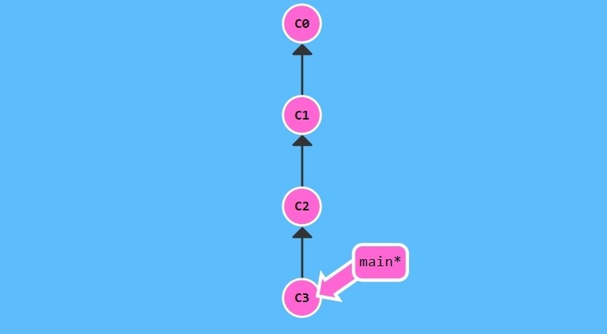
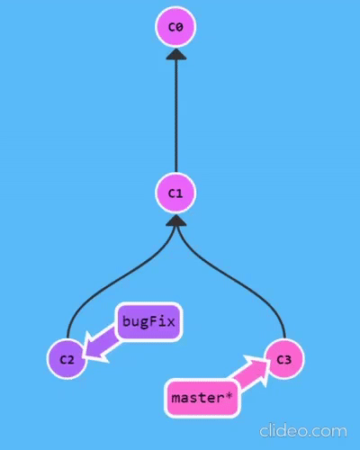

# **What is Git?**

**Git** is a console tool for tracking and maintaining a history of file changes in your project. Most often it is used for code, but it can be used for other files as well. For example, for pictures - useful for designers.

With **Git** - you can rollback your project to an older version, compare, analyze or merge your changes into a **repository**.

**Repository** refers to the repository of your code and the history of its changes. **Git** works locally and all your repositories are stored in specific folders on your hard drive.

Also, your repositories can be stored on the Internet. Usually three services are used for this:

- [GitHub](https://github.com/)
- [Bitbucket](https://bitbucket.org/)
- [GitLab](https://gitlab.com/)

Each savepoint in your project is named **commit**. Each **commit** has a **hash (unique id)** and a comment. From such **commit**-s a **branch** is built. **Branch** is the history of changes. Each branch has its own name. A repository can contain several branches that are created from or merged into other branches.

# **How Git works**

If you look at the picture, it becomes a little easier with understanding. Each circle is a **commit**. The arrows show the direction from which **commit** the next is made. For example, `C3` is made from `C2`, etc. All these **commit** are in a branch called `main`. This is the master branch, most commonly referred to as `master` . The `main*` rectangle shows which **commit** we are currently in, in other words, a pointer.



The result is a very simple graph consisting of one branch (main) and four commits. All this can turn into a more complex graph, consisting of several branches that merge into one.



# **Initial Git setup**

1. Run installed git bash program (black, scary terminal)
2. Enter the command `git config --global user.name "Firstname Lastname"` and press **Enter**
3. Enter the command `git config --global user.email <email>` and press **Enter**
4. Check if the settings have been applied with the command `git config --list --show-origin`
   If the terminal shows the entered username and email, then everything is OK
   read online for free

# **Basic command line operations (terminal, console)**

Before you start using the git, you need to master the basic commands that are executed in the operating system through the terminal.

**ls**

- The most commonly used command is `ls`
- This command lists the files in the current active directory.
- Show all files, including hidden ones: `ls -a`

**cd**

- By default, the terminal opens in the user's directory, i.e. in the home folder on your computer's hard drive.
- Moving through directories is done with the command `cd “directory name”`
- Move up a directory one level up: `cd ..`
- Move up a directory 2 levels up: `cd ../../`

**mkdir**

- Command to create a directory: `mkdir “directory name”`

**touch**

- Command to create an empty file: `touch “filename”`

**cp**

- Command for copying a file: `cp “name of the copied file” “new name of the copied file”`

**mv**

- Command to rename a file: `mv “file name” “new filename”`

**echo**

- Command to write to file: `echo “Text” > “filename”`

**cat**

- View file contents: `cat “filename”`

**rm**

- Command to delete a file:`rm “filename”`

**rm -R**

- Command to recursively remove (remove all files inside a directory and the directory itself) a directory: `rm -R “directory name”`

# The algorithm works with the git repository

1. Create a directory
2. Initialize the repository with the command `git init`
3. View repository status: `git status`
4. Add file to staged: `git add “filename” or git add .`
5. Make a commit: `git commit -m “Commit message”`

# **Algorithm for working with an already initialized repository**

1. Check repository status: `git status`
2. Add modified file to staged: `git add “filename” or git add .`
3. Make a commit: `git commit -m “Commit message”`

# **Creating a commit with vim**

We learned that you can create commits with the command `git commit -m ‘Commit message’`. In addition to this method, we can create a commit using the Vim code editor that is built into git.

To make a commit, you need to write the git commit command without the -m flag. An incomprehensible code editor will open right inside the terminal. This editor is called Vim. It is the same code editor as VS Code. Vim runs inside the console and you can write code in it. Vim is a very powerful and incredibly fast code editor. There are projects where there are thousands and thousands of lines of code in one file. Regular graphical editors may have difficulty processing such files, but Vim can handle such files with ease.

So, after the git commit command, the terminal opened Vim for us. How now to write the commit message in it? To start writing the file, you need to press the i key and type the commit message. After that press `esc` then `:` and `wq`. The wq (write quit) command means to write a file and then quit.

# **Git commit command with -am flag**

The git commit command can be used with the -am flag: `git commit -am ‘Commit message’` - this command immediately adds files to staged and commits with the specified message

# **Commit empty directories**

By default, git does not add empty directories to a commit. If you need an empty directory to be included in the commit, then you need to create a **.gitkeep** file inside the directory

# **Ignoring files**

If you need to exclude some files or directories from commits, you need to create a .gitignore file and write the name of the files or directories in gitignore.

# **History of commits**

**gitlog**

- git log command shows commit history

  **git log with --oneline flag**

- The git log --oneline command shows the commit history in a compact way without additional data

  **git checkout --**

- Command to rollback files that have not yet been staged: `git checkout -- “Name of file(s)”`

**git checkout “commit hash”**

- Command to switch over commits: `git checkout “commit hash”`

**git reset**

- Command to rollback files that got into staged: `git reset “filename”`

**git reset --hard**

- Command to roll back files that have already been committed: `git reset --hard HEAD^1`

# **Branches**

**git branch**

- This command shows the existing branches in the repository

**git branch**
This command can also create a branch if you specify the name of the branch to be created: `git branch “branch name”`

**git checkout**

- This command allows you to switch between branches: `git checkout “branch name”`

**git checkout -b**

- This command creates and immediately switches the pointer, but the created branch: `git checkout -b “branch name”`

**git merge**

- Command to merge branches: `git merge “branch name”`

**git branch -d**

- Command to delete a branch: `git branch -d “branch name”`

# We will learn how to create remote repositories, how to link a remote repository to a local one, and much more.

**List of commands we'll cover:**

**`git remote add`**

- Adding a remote repository
  To add a new remote, use the git remote add command on the terminal, in the directory your repository is stored at.
- The git remote add command takes two arguments:

A remote name, for example, origin

A remote URL, for example, https://github.com/OWNER/REPOSITORY.git

For example:

```$ git remote add origin https://github.com/OWNER/REPOSITORY.git
# Set a new remote
$ git remote -v

# Verify new remote

> origin https://github.com/OWNER/REPOSITORY.git (fetch)
> origin https://github.com/OWNER/REPOSITORY.git (push)
```

**`git push`**

### The git push command takes two arguments:

- A remote name, for example, origin
- A branch name, for example, main

For example:

```
$ git push REMOTE-NAME BRANCH-NAME
```

As an example, you usually run git push origin main to push your local changes to your online repository.

**`git pull`**

**git pull** is one of the 4 remote operations within Git. Without running **git pull**, your local repository will never be updated with changes from the remote. **git pull** should be used every day you interact with a repository with a remote, at the minimum. That's why **git pull** is one of the most used Git commands.

```
$ git pull
```
